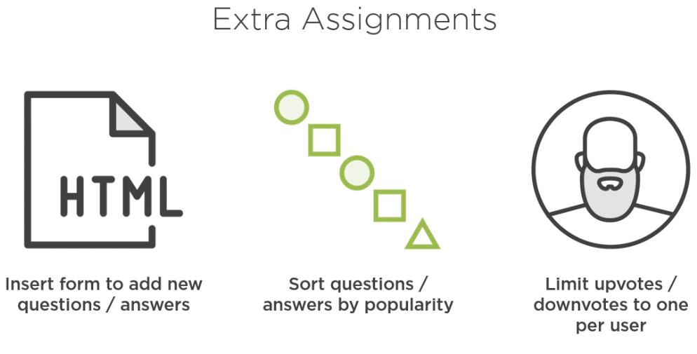

# Introduction
This is a project used to learn react on pluralsight. It is a small application used to present questions and asnswers and enables users to vote for a answers.

## To run
```
npm run build

npm start
```

## Learnings


## To Di




# To fix

- Increment and decrement of votes

# Reference

[server-rendered-react-app](https://github.com/danielstern/server-rendered-react-app)